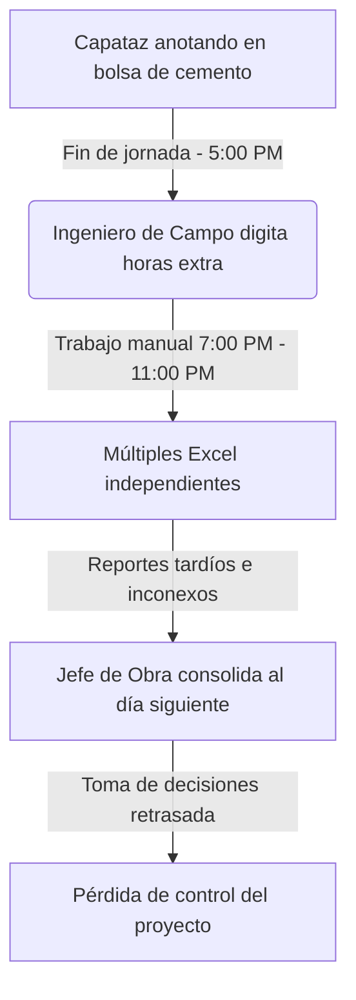
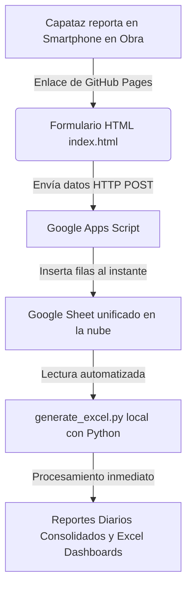

# Manual y Guía Paso a Paso: Clase 4 - Automatización de Reportes Diarios Colaborativos
> **Curso:** Automation Engineer  
> **Clase:** 4ta Clase (Grabada el 17 de Mayo de 2026)  
> **Tema:** Transición de automatizaciones locales a flujos colaborativos en la nube con Antigravity, GitHub Pages y Google Sheets.

---

## 🎯 1. Objetivos del Negocio y Técnicos

### El Problema Tradicional en Obra
En la gestión de proyectos de construcción tradicionales, el flujo de información de campo sufre un grave cuello de botella:
1. Los capataces y subcontratistas anotan el personal, materiales y avances en papeles físicos, libretas o incluso bolsas de cemento vacías al finalizar la jornada laboral (5:00 PM).
2. El Ingeniero de Campo recibe estos apuntes físicos y pasa horas de trabajo manual (típicamente de 7:00 PM a 11:00 PM) copiando, digitando y formateando los datos en múltiples hojas de Excel independientes.
3. El Jefe de Obra o el Ingeniero de Control de Proyectos recibe estos reportes por separado tarde en la noche, teniendo que consolidarlos manualmente para poder armar un reporte gerencial al día siguiente.



### La Solución de la Clase 4
Desplegar una **aplicación web móvil responsiva en formato 9:16** alojada de forma gratuita en la nube. Los capataces, ingenieros de seguridad y controladores de calidad llenan sus reportes diarios en vivo directamente desde sus teléfonos móviles. Los datos se envían de forma instantánea a una hoja de cálculo unificada en **Google Sheets** mediante un servicio ligero y gratuito de **Google Apps Script**. Finalmente, un script local de Python procesa los datos consolidados y genera tableros automatizados en segundos.



---

## ⏱️ 2. Cronología Minuto a Minuto de la Clase (Desde Minuto 32:00)

### 🔹 Minuto 32:00 a 37:30 - Configuración Inicial de Carpeta y Primer Prompt
* **Acción del Profesor:** Aurelio guía a los alumnos a abrir **Antigravity** en sus computadoras y crear la estructura de carpetas en Windows Explorer:
  `Automation Engineer` -> `4ta Clase` -> `Reporte diario`.
* **Vinculación con el Agente:** En la barra superior de Antigravity, los alumnos seleccionan `Open Folder` para cargar la carpeta recién creada, permitiendo que el asistente de IA tenga acceso al directorio del proyecto.
* **El Primer Prompt (Diseño Inicial del Formulario):** Aurelio introduce el prompt base para programar el HTML móvil.

> [!IMPORTANT]
> **Prompt 1: Generación del Formulario Móvil HTML en Formato 9:16**
> ```text
> Requiero hacer un reporte diario del avance de obra para un proyecto de edificación de vivienda unifamiliar.
> La idea es que este reporte sea en HTML y esté diseñado para los smartphones (celulares) de los colaboradores que están en obra.
> La información se vincule y descargue en Google Drive (Google Sheet).
> Por ahora, genera primero el archivo HTML con formato profesional, estructurado para celulares en formato 9:16.
> ```

### 🔹 Minuto 37:30 a 53:00 - Compilación y Primera Revisión Visual Local
* **Acción de Antigravity:** El agente procesa el requerimiento, crea el archivo `index.html` en la carpeta y levanta un sub-agente navegador en una dirección local (`127.0.0.1` o `localhost`) para validar visualmente la app en vivo.
* **Recomendación Técnica de Aurelio:** El profesor advierte a los estudiantes configurar el modelo de Antigravity en **Gemini 3 Flash** para tareas comunes y dejar **Gemini 1.5 Pro** solo para problemas de lógica extremadamente complejos, debido a que el plan de tokens de Gemini Pro puede agotarse rápidamente en flujos largos de iteraciones visuales.
* **Características del Formulario Generado:**
  * **Cabecera interactiva:** Datos del proyecto (Nombre, fecha interactiva con selector, responsable de obra).
  * **Control de Clima y Turno:** Botones rápidos para indicar estado del clima (soleado, lluvioso, nublado) y jornada (diurna/nocturna).
  * **Contador Dinámico de Cuadrillas:** Sumador en tiempo real de recursos de mano de obra (Capataces, operarios, oficiales, peones).
  * **Actividades Realizadas:** Sección interactiva para ingresar tareas, sector de la obra, estado (inicio, en proceso, paralizado) y una barra deslizable (slider) para porcentaje de avance (0% a 100%).
  * **Gestión de Materiales e Incidentes:** Casillas rápidas para ingreso de materiales recibidos, incidentes de seguridad y subida de evidencias fotográficas.
  * **Firma Digital Interactiva:** Un lienzo canvas HTML5 profesional que permite realizar firmas a mano alzada y cuenta con botón de limpiado.
* **Duda y Problema Técnico de César Aguedo (Min 50:00):** César reporta que Antigravity se interrumpe y muestra una alerta roja en la interfaz: `"Agent Terminated with Error"`. 
  * *Solución del Profesor:* Aurelio le explica que es un problema ocasional de conexión o de instalación. Le enseña a usar el **botón azul de retroceso (Undo/Reciclar)** en el chat de Antigravity para borrar los pasos fallidos y volver a ejecutar el Prompt 1. Al persistir el error en el equipo de César, le sugiere reiniciar el agente o reinstalar la herramienta.

### 🔹 Minuto 53:00 a 01:21:00 - Migración de API Compleja a Google Apps Script
* **Revisión de Entregables de Alumnos:** Los alumnos comparten capturas de pantalla de sus formularios. Luis Pariona nota que, aunque su formulario es idéntico en estructura, no le autogeneró el lienzo de la firma digital. Aurelio explica que la generación de LLMs tiene un carácter estocástico (aleatorio) y que las pequeñas variaciones son normales.
* **El Cambio de Enfoque Técnico:** Aurelio analiza el código generado y observa que el agente propone el uso de una API estándar de Google Cloud para almacenar la información en Sheets. Aurelio advierte que **las APIs de Google Cloud son de pago** y requieren configurar cuentas de facturación complejas.
* **La Solución Alternativa (Google Apps Script):** Propone reestructurar el envío de datos para usar un servicio web nativo y **100% gratuito** de Google: **Google Apps Script (Web App)**. 

> [!IMPORTANT]
> **Prompt 2: Adaptación del backend a Google Apps Script**
> ```text
> No quiero vincular a una API de pago. Solo quiero que uses Google Apps Script para pasar la información directamente desde el HTML index de GitHub a Google Sheets.
> ```

* **Resultado:** Antigravity reescribe el JavaScript del formulario en `index.html` para realizar peticiones HTTP `POST` a una URL externa y genera el código en JavaScript para el servidor: `google_apps_script.gs`.
* Aurelio aclara la diferencia: una **API** con inteligencia artificial toma decisiones sobre cómo estructurar el contenido de manera dinámica, mientras que un **script** (software estructurado tradicional) es una tubería rígida y directa que inyecta la información celda por celda sin procesamiento inteligente, lo cual es más económico y seguro para guardar registros tabulares rígidos.

### 🔹 Minuto 01:21:00 a 02:22:00 - Publicación en la Nube mediante GitHub Pages
Aurelio explica que, para que el enlace sea verdaderamente colaborativo y utilizable desde cualquier smartphone en el mundo, debe estar alojado en la nube. Introduce a los estudiantes al uso de **GitHub**.

* **El Prompt de Guía en Antigravity:**
> [!TIP]
> **Prompt 3: Solicitud de Guía para Creación de Cuenta y Repositorio**
> ```text
> ¿Puedes ayudarme a crear mi cuenta en GitHub y también a crear mi primer repositorio?
> ```
* **Creación de Repositorio (Paso a Paso):**
  1. Registrarse o iniciar sesión en [github.com](https://github.com).
  2. En la esquina superior derecha, hacer clic en el botón **`+`** y seleccionar **`New Repository`** (Nuevo Repositorio).
  3. Nombrar el repositorio como: `reporte-diario-obra` (Aurelio advierte evitar espacios y usar guiones medios).
  4. En la descripción, ingresar: *Formulario móvil en 9:16 para reporte diario de vivienda unifamiliar*.
  5. **Regla de Oro:** Configurar el repositorio como **PÚBLICO** (obligatorio para activar la opción gratuita de alojamiento de GitHub Pages).
  6. Dejar desmarcadas las opciones de *Add a README file* y *Add .gitignore* o *License*. Hacer clic en **`Create Repository`**.
* **Subida del Código a GitHub:**
  * Dentro del repositorio recién creado, hacer clic en el enlace **`uploading an existing file`** (Subir un archivo existente).
  * Arrastrar o seleccionar el archivo `index.html` generado por el agente localmente.
  * *Buenas Prácticas del Programador:* Aurelio recalca la importancia de que el archivo se llame estrictamente **`index.html` en minúsculas**. Los servidores web y los agentes de IA reconocen este nombre universalmente como la raíz o landing page por defecto de un portal.
  * Hacer clic en el botón verde **`Commit changes`** (Confirmar cambios).
* **Despliegue del Sitio (GitHub Pages):**
  1. Ir a la pestaña **`Settings`** (Configuración) en el menú superior del repositorio.
  2. En el panel izquierdo, bajar hasta la sección **`Pages`**.
  3. En la sección *Build and deployment, cambiar el origen bajo la rama (Branch) de `None` a **`main`** (o `master`) y dejar la carpeta como `/root`.
  4. Presionar **`Save`** (Guardar).
  5. Esperar aproximadamente 2 minutos. Al recargar la página de Settings, en la parte superior se generará el enlace web público universal (por ejemplo: `https://aureliorio.github.io/reporte-diario-obra/`).
* **Resolución de Error 404 de Guillermo Franleo:** Guillermo comparte que al abrir su link obtiene un error `404 - Page Not Found`.
  * *Solución de Aurelio:* Aurelio identifica que el archivo de Guillermo no se llamaba `index.html` sino que lo había subido con mayúsculas (`ReporteDiario.html` u otra variante). Le enseña a entrar a la pestaña **`Code`** en GitHub, seleccionar **`Add file`** -> **`Upload files`**, arrastrar el archivo con el nombre correcto `index.html` en minúsculas, presionar **`Commit Changes`** y borrar el archivo anterior. Tras 2 minutos, el enlace de Guillermo funciona perfectamente.
* **Consulta Estética de Luis Pariona:** Luis pregunta si hay alguna forma de acortar la extensión de los enlaces de GitHub, ya que son muy largos y poco estéticos para compartir con clientes. Aurelio explica que GitHub Pages no lo permite por defecto, pero se puede resolver de dos formas: comprando un hosting propio (dominio personalizado) o usando plataformas modernas como **Vercel** o **Netlify**, que permiten personalización gratuita del subdominio (tal como usa Aurelio para el portal del curso: `vercel.app`).

### 🔹 Minuto 02:22:00 a 02:49:00 - Generalización de la Aplicación mediante un WBS Externo
Guillermo hace una observación muy valiosa: *¿Es necesario editar el código HTML de index.html cada vez que cambien las partidas del presupuesto o las actividades de obra de un nuevo proyecto?*

Aurelio elogia la pregunta de Guillermo y propone hacer el formulario completamente **modular, dinámico y genérico**, vinculándolo a un archivo Excel externo (`plantilla_wbs.xlsx`) que servirá como la base de datos de la estructura de descomposición del trabajo (WBS/EDT). Si cambias de obra, solo actualizas las celdas del Excel en GitHub y la app se adapta automáticamente sin programar.

> [!IMPORTANT]
> **Prompt 4: Vinculación Dinámica a Plantilla Excel Externa (WBS/EDT)**
> ```text
> Deseo que el archivo index trabaje conjuntamente con un archivo Excel (plantilla_wbs.xlsx).
> Es decir, la aplicación debe ser genérica. En el archivo Excel se tiene que definir el WBS (EDT) y la descripción de las actividades, y el archivo index debe tomar dicha información y mostrarla al equipo del proyecto.
> De modo que si cambio de proyecto, solo tengo que actualizar el archivo Excel y el index se adaptará a otro proyecto similar.
> Como entregable, deseo el index actualizado y el Excel formateado (plantilla_wbs.xlsx).
> ```

* **Acción de Antigravity:** El agente reescribe por completo el archivo `index.html`, integrando una librería de CDN para lectura de hojas de cálculo binarias del lado del cliente (`xlsx.full.min.js`), y genera el archivo `plantilla_wbs.xlsx` con columnas predefinidas: `WBS_Code`, `Activity_Description`, `Sector`, `Status`.
* **Advertencia Técnica de Rendimiento (Aurelio):** El profesor explica que el navegador de un celular procesa el Excel en memoria. Si el archivo Excel es ligero (menor a 3 - 5 MB), la app móvil lo leerá instantáneamente. Sin embargo, si el Excel de control es un archivo extremadamente pesado (con miles de filas y fórmulas complejas de 10 MB a más), se corre el riesgo de congelar el navegador móvil. En esos casos avanzados, se debe usar un script de **Python** como intermediario en el servidor para parsear la data pesada y entregar un JSON compacto al HTML móvil.
* **Publicación y Prueba Dinámica:** Los alumnos suben ambos archivos actualizados al repositorio en GitHub. Tras esperar la compilación, recargan sus celulares y comprueban con asombro que los desplegables de "Actividades" ahora muestran dinámicamente las partidas de Excel (como *Vaciado de concreto en columnas*, *Habilitado de acero*, etc.) en tiempo real.

### 🔹 Minuto 02:49:00 a Fin de Clase - Casos de Negocio, Inteligencia Multimodal y Cierre

#### 1. Caso Práctico de Wilber Carbajal: Automatización y Auditoría de Valorizaciones del Estado
* **El Problema:** Wilber trabaja en la ejecución de obras públicas por administración directa bajo la nueva Directiva 17. Debe sustentar de forma rigurosa las valorizaciones mensuales presentadas a la entidad pública. Actualmente, llena diariamente el **Cuaderno de Obra Digital** oficial de la plataforma *InfoObras* del gobierno, el cual le genera y exporta archivos PDF diarios. Al final del mes, auditar, extraer los metrados acumulados de los 30 PDFs diarios y plasmarlos manualmente en la valorización consolidada es un proceso lento y propenso a errores que le quita días enteros de trabajo.
* **La Solución Propuesta con IA:** Aurelio confirma que este es un excelente caso para monetizar. Propone un portal donde Wilber pueda subir en bloque los 30 PDFs mensuales. Un agente inteligente de Antigravity (apoyado en la API multimodal de Gemini) leerá, procesará el texto de los 30 PDFs, extraerá de forma estructurada los metrados reportados día a día por partida, cruzará los datos contra la base del presupuesto y autogenerará la plantilla Excel de la valorización final auditada y completamente sustentada con coherencia total.
* Aurelio se compromete a llamarlo durante la semana para modelar y diseñar este desarrollo conjunto.

#### 2. Caso Práctico de Roberto Loayza: Control de Protocolos y Redlines para Supervisión de Obras
* **El Problema:** Roberto pertenece al equipo de Supervisión de Obra. Debe revisar y aprobar 21 valorizaciones de contratistas al mes. Pasa de 5 a 6 días mensuales cruzando hojas de metrados, protocolos físicos de calidad aprobados en campo y planos Redlines (planos marcados en amarillo que detallan la geometría real de lo construido).
* **La Solución Propuesta con IA:** Aurelio explica que los protocolos escaneados pueden ser leídos por OCR avanzado con IA para compilar los metrados autorizados y cruzarlos de forma automatizada contra los números declarados por el contratista en su reporte de Excel, detectando discrepancias numéricas de forma inmediata.
* **Revelación Tecnológica de Vanguardia (Gemini Robotic / Multimodal Live):** Aurelio comparte su asombro tras probar una nueva tecnología en Google AI Studio enfocada en razonamiento espacial y robótica. Le subió a la IA un plano arquitectónico en planta (2D) junto con una elevación y corte. La IA entendió de forma impresionante la relación 3D de los dibujos, correlacionó la planta con el corte vertical e interpretó de forma precisa las dimensiones para calcular un metrado consolidado exacto en segundos. Aurelio indica que planea incorporar este tipo de entrenamiento de IA en las siguientes clases.

#### 3. Cierre y Conclusiones del Grupo
* Luis Pariona felicita al profesor y expresa una frase contundente:  
  > *"Profesor, solo con el contenido de esta clase práctica de hoy, ya se pagó con creces el precio total de todo el curso. Esto es alucinante y nos abre los ojos a un nuevo nivel profesional."*
* Aurelio agradece las palabras del grupo, los insta a seguir iterando sus portales y formularios en la semana, y concluye remarcando que el Ingeniero de Control de Proyectos que aprenda a implementar estas soluciones de IA colaborativas se convertirá en la cara y líder de la transformación digital de sus respectivas organizaciones.

---

## 🛠️ 3. Resumen y Vault de Prompts Utilizados en la Clase

Para que puedas replicar o ampliar este ejercicio de forma idéntica, a continuación se recopilan los prompts exactos en orden secuencial:

| Paso | Objetivo del Prompt | Prompt Verbatim (Español) |
|---|---|---|
| **1** | Crear la app HTML móvil en formato vertical 9:16 | `Requiero hacer un reporte diario del avance de obra para un proyecto de edificación de vivienda unifamiliar. La idea es que este reporte sea en HTML y esté diseñado para los smartphones (celulares) de los colaboradores que están en obra. La información se vincule y descargue en Google Drive (Google Sheet). Por ahora, genera primero el archivo HTML con formato profesional, estructurado para celulares en formato 9:16.` |
| **2** | Cambiar backend de API de pago a Google Apps Script gratuito | `No quiero vincular a una API de pago. Solo quiero que uses Google Apps Script para pasar la información directamente desde el HTML index de GitHub a Google Sheets.` |
| **3** | Solicitar guía e instrucciones para crear cuenta en GitHub | `¿Puedes ayudarme a crear mi cuenta en GitHub y también a crear mi primer repositorio?` |
| **4** | Hacer la app genérica leyendo partidas dinámicas desde un Excel | `Deseo que el archivo index trabaje conjuntamente con un archivo Excel (plantilla_wbs.xlsx). Es decir, la aplicación debe ser genérica. En el archivo Excel se tiene que definir el WBS (EDT) y la descripción de las actividades, y el archivo index debe tomar dicha información y mostrarla al equipo del proyecto. De modo que si cambio de proyecto, solo tengo que actualizar el archivo Excel y el index se adaptará a otro proyecto similar. Como entregable, deseo el index actualizado y el Excel formateado (plantilla_wbs.xlsx).` |

---

## 📋 4. Tabla de Dudas / Consultas y Cómo se Resolvieron

| Alumno | Duda / Problema Técnico Planteado | Solución Brindada por el Profesor (Aurelio Solórzano) |
|---|---|---|
| **César Aguedo** | Antigravity se interrumpió y arrojó una alerta de error en rojo: `Agent Terminated with Error`. | Se le indicó usar el **botón azul de retroceso (Undo/Reciclar)** en el chat de Antigravity para limpiar la caché de las últimas líneas de prompt fallidas e intentar correr el prompt base de nuevo. Al persistir el error, se sugirió el reinicio/reinstalación del agente para liberar conflictos de puerto de red local. |
| **Luis Pariona** | ¿Por qué el código generado por la IA en mi computadora no incluye el lienzo (canvas) de firma digital si usamos el mismo prompt? | Explicó que las respuestas de los Modelos de Lenguaje (LLMs) tienen componentes **estocásticos** (pequeñas variaciones aleatorias). La IA es creativa en el código y no genera exactamente el mismo layout a todos, pero que esto se corrige fácilmente haciendo un prompt de seguimiento directo para añadir la sección específica (ej: *"Agrega un lienzo canvas interactivo de firma digital al final del index"*). |
| **Guillermo Franleo** | Recibe un error `404 Page Not Found` en su enlace público de GitHub Pages. | Aurelio le explicó que se debe a que subió el archivo web con un nombre personalizado en mayúsculas (ej. `ReporteObra.html`). **GitHub Pages busca estrictamente un archivo llamado `index.html` (todo en minúsculas)** como punto de entrada de la web. Se solucionó renombrando el archivo a `index.html` en minúsculas y volviéndolo a subir al repositorio. |
| **Luis Pariona** | ¿Cómo acortar y embellecer los links de GitHub Pages para compartirlos con directores de proyectos o clientes? | Mencionó que la limitación es de GitHub, pero que se puede superar comprando un dominio web propio, o desplegando la aplicación de forma gratuita en plataformas como **Vercel** o **Netlify**, que otorgan nombres de subdominio personalizables mucho más cortos y limpios. |
| **Guillermo Franleo** | ¿Cómo evitar cambiar el código HTML cada vez que cambien las actividades de obra de una nueva edificación? | Se propuso desvincular los datos estáticos del HTML. El profesor le enseñó a formular el Prompt 4 para indicarle a Antigravity que integre la librería `xlsx.js` en el HTML, permitiendo que la aplicación lea dinámicamente el WBS directamente desde un archivo Excel local llamado `plantilla_wbs.xlsx`. |
| **Wilber Carbajal** | ¿Cómo trabajar o realizar cálculos y reportes en campo en zonas donde **no hay señal ni conexión a Internet**? | Aurelio aclaró que un archivo `.html` compilado en formato móvil 9:16 es independiente. Se puede enviar por WhatsApp y **el capataz puede abrirlo sin internet en su celular**, ingresando datos y realizando sumas o cálculos locales. El único detalle es que la carga y sincronización con el Google Sheet de la nube esperará a que el smartphone tenga conexión WiFi o datos celulares para mandar el paquete HTTP. |
