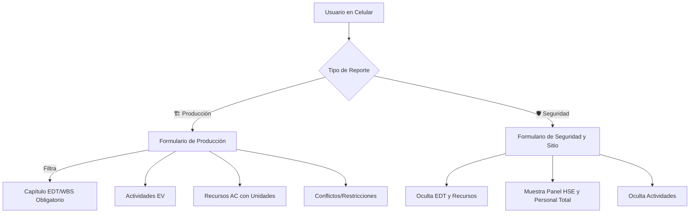

# 📘 Especificación de Transferencia y Conocimiento: Reporte Diario de Obra (RDO)

Este documento contiene todo el conocimiento arquitectónico, técnico y de bases de datos de la plataforma de **Reporte Diario de Obra (RDO)**. Su propósito es servir de guía de inicio inmediato (Handover) para reanudar el desarrollo sin fricciones en cualquier nueva carpeta o espacio de trabajo.

---

## 🎯 1. Objetivo General del Proyecto
La aplicación es una plataforma móvil híbrida (HTML5/JS/CSS vainilla y Google Sheets/Apps Script) diseñada para el control físico y financiero en tiempo real de proyectos de construcción (como el de Vivienda Unifamiliar), basándose en la metodología **EVM (Earned Value Management)**.

Busca resolver la fragmentación del reporte de campo, permitiendo a los capataces y supervisores registrar de manera ágil y controlada:
* **Avance Físico (Earned Value - EV):** Actividades realizadas con metrados comparados contra metas diarias planificadas.
* **Costos Reales (Actual Cost - AC):** Consumos de recursos de mano de obra, materiales y equipos.
* **Control y Seguridad (HSE):** Conteo de personal total en sitio, inspecciones y accidentes.

---

## 🏗️ 2. Arquitectura de Reporte Dual (Producción vs. Seguridad)
Para evitar la distorsión de bases de datos y la duplicación de operarios en obra, la plataforma implementa una **arquitectura dual** con un selector independiente premium en la cabecera:



### Reglas de Negocio Clave:
1. **Un reporte de producción = Un frente de trabajo (Capítulo EDT/WBS)**. Esto garantiza la homogeneidad y la integridad para el cálculo de EVM por capítulo.
2. **Un reporte de seguridad = Control de sitio global**. No se asocia a ningún código EDT de costo, registrando datos limpios del total de la fuerza laboral y eventos de seguridad.
3. **Validación Dinámica**: En modo *Producción*, el selector de capítulo EDT es obligatorio (`required`). En modo *Seguridad*, este selector se oculta y deja de ser obligatorio para evitar bloqueos del navegador en el envío.

---

## 📊 3. Estructura de la Base de Datos Central (Google Sheets)
El backend en **Google Apps Script** procesa los datos y los distribuye automáticamente en **4 tablas (pestañas)** con diseños y cabeceras HSL estilizadas de alto contraste:

### 1️⃣ `R_Produccion` (Gris Oscuro `#1e293b`)
Registra las cabeceras de producción ligadas a capítulos EDT/WBS.
* **Columnas:** `ID Reporte`, `Fecha Envío`, `Fecha Reporte`, `Supervisor/Ingeniero`, `Turno`, `Clima Mañana`, `Clima Tarde`, `Horas Efectivas`, `Capítulo WBS ID`, `Capítulo WBS Nombre`, `Conflictos/Restricciones`, `Trabajos Mañana`, `Observaciones Generales`.

### 2️⃣ `R_Seguridad` (Verde Esmeralda `#047857`)
Registra las auditorías HSE y el total de personal sin acoplamientos WBS.
* **Columnas:** `ID Reporte`, `Fecha Envío`, `Fecha Reporte`, `Supervisor/Ingeniero`, `Turno`, `Clima Mañana`, `Clima Tarde`, `Personal Total en Obra`, `Inspecciones Realizadas`, `Detalle Inspecciones`, `Accidentes/Incidentes`, `Observaciones Generales`.

### 3️⃣ `Detalle_Actividades` (Gris Pizarra `#334155`)
Desglose detallado del metrado físico ejecutado para la Curva S y EVM.
* **Columnas:** `ID Reporte`, `Fecha Reporte`, `Supervisor/Ingeniero`, `Capítulo WBS ID`, `Actividad WBS ID`, `Nombre Actividad`, `Unidad`, `Meta del Día`, `Cantidad Ejecutada`, `Avance Estimado`, `Observación/Comentario`.

### 4️⃣ `Detalle_Recursos` (Azul Índigo `#4338ca`)
Detalle de costos reales (Mano de Obra de obra, Materiales y Equipos) por capítulo.
* **Columnas:** `ID Reporte`, `Fecha Reporte`, `Supervisor/Ingeniero`, `Tipo Recurso`, `Capítulo WBS ID`, `ID Recurso`, `Descripción Recurso`, `Categoría/Detalle`, `Unidad`, `Cantidad Registrada`.

---

## 🗄️ 4. Estructura de Archivos Maestros (Bases de Datos Excel)
La aplicación carga y autocompleta el formulario usando cuatro archivos Excel maestros ubicados en `./data/`:

* **`BD_EDT.xlsx`**: Estructura de desglose del trabajo (WBS). Nivel 1 = Capítulos (ej: `1.0 Obras Preliminares`), Nivel 2 = Actividades (ej: `1.1 Limpieza de terreno manual`).
* **`BD_Metrados_Planificados.xlsx`** (Ex archivo PV): Contiene las metas planificadas diarias de metrado por actividad basadas en el cronograma del proyecto (del 15/05/2026 en adelante).
* **`BD_RRHH.xlsx`**: Catálogo de mano de obra directa perteneciente al Costo Directo (AC), del rango de capataz hacia abajo (excluye supervisores que son Gastos Generales).
* **`BD_Almacen.xlsx`**: Catálogo unificado de materiales y equipos (clasificados en la columna `tipo`).

---

## 🛠️ 5. Especificaciones Técnicas y Funciones Clave (JS)

Para reanudar la edición en el frontend de `index.html`, estas son las funciones núcleo implementadas:

### 🔄 Selector de Reporte Dinámico: `setReportType(type)`
```javascript
function setReportType(type) {
  const isProd = type === "production";
  $("#reportType").value = type;
  
  // Toggles de botones
  $("#btnTypeProd").className = isProd ? "active-class" : "inactive-class";
  $("#btnTypeSafety").className = !isProd ? "active-class" : "inactive-class";
  
  // Ocultar/mostrar contenedor de Capítulo EDT
  $("#globalChapterContainer").classList.toggle("hidden", !isProd);
  $("#globalChapter").required = isProd;
  
  // Ocultar/mostrar acordiones de producción vs seguridad
  ["#activitiesAccordion", "#laborAccordion", "#materialsAccordion", "#equipmentAccordion", "#issuesAccordion"].forEach(id => {
    $(id).classList.toggle("hidden", !isProd);
  });
  $("#safetyAccordion").classList.toggle("hidden", isProd);
}
```

### ⚡ Visualización Dinámica de Unidades de Recurso
El template `#resourceTemplate` incluye un campo de solo lectura `.unit-indicator`. Al agregar o cambiar un recurso:
1. `fillResourceSelect` incluye el sufijo `[Unidad]` en las opciones del desplegable.
2. Al disparar el evento `change` del selector, la función busca el recurso en `state.masters` y coloca su unidad en `.unit-indicator` (ej: `bolsa`, `kg`, o `H-H` por defecto para mano de obra).

---

## 🔑 6. Configuración de API Activa
* **Google Apps Script Web App URL:**
  `https://script.google.com/macros/s/AKfycby9McwaX9r1Kls2YwYcP1x-fW1aQe5_aWT1qkLLKUM6eiZ5SyLextKCjDk-l-YSMip1mw/exec`
  *(Ya configurado en la variable `CONFIG.GAS_WEBAPP_URL` de `index.html`)*.

---

## 🎯 7. Pasos para Iniciar en la Nueva Carpeta
Cuando inicies la conversación en el nuevo directorio de desarrollo de proyectos, pídele al agente de IA lo siguiente:

1. *"Lee el archivo [resumen_transferencia_rdo.md](file:///d:/Project%20Control%20AI/Automation%20Engineer/4ta%20Clase/Reporte%20diario/resumen_transferencia_rdo.md) para comprender la arquitectura dual de Producción y HSE, el esquema de 4 pestañas de Sheets y los archivos maestros de Excel."*
2. *"Ayúdame a configurar el nuevo repositorio de Git en esta carpeta y realizar el primer push a [reporte-diario-obra](https://github.com/aureliosrios/reporte-diario-obra) para activar GitHub Pages."*
